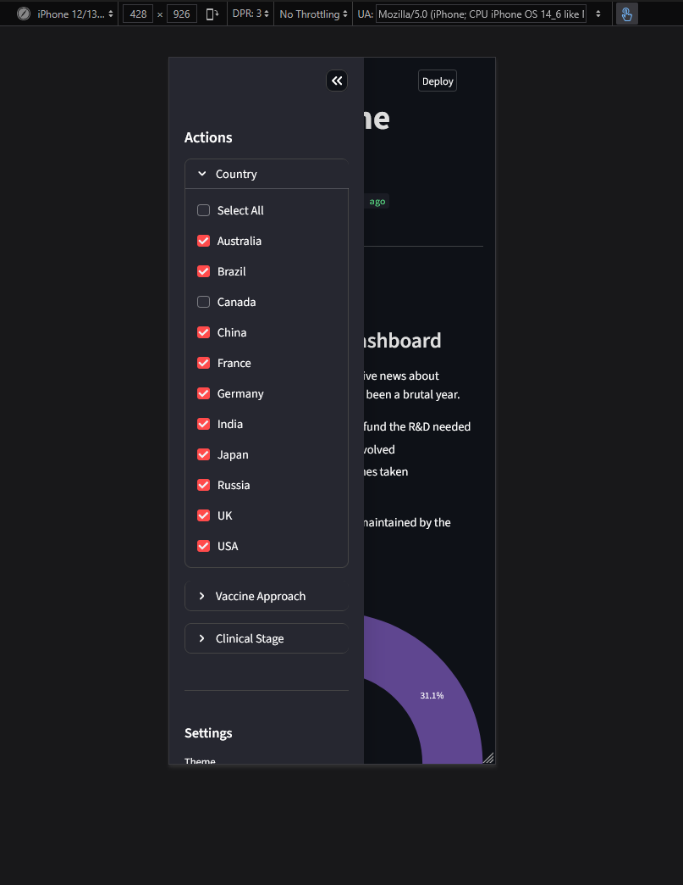
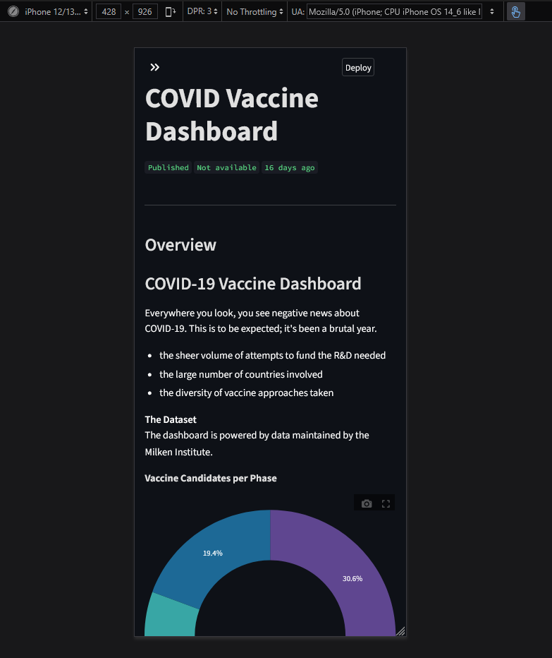
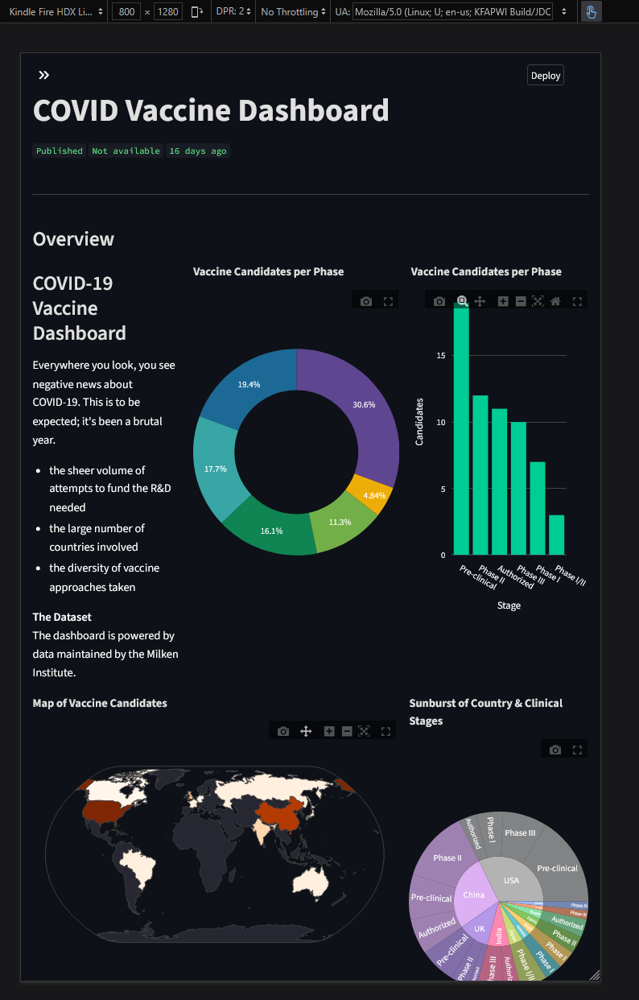

# Streamlit POC

> COVID-19 Vaccine Dashboard, powered by data maintained by the Milken Institute.

### UI Overview

#### Dark-theme


#### Light-theme


#### Print/Save as PDF


#### Mobile-Friendly design





### Project structure

```text
src/
├── main.py              # Main script
├── config.py            # App configs
├── domain/
│   └── models.py        # Data models
├── services/
│   ├── base_data.py     # Protocol definition
│   ├── mock_data.py     # Mock data provider
│   └── postgres_data.py # PostgreSQL data provider
└── ui/
    ├── __init__.py      
    ├── components.py    # Chart components
    ├── sidebar.py       # Sidebar controls
    └── styles/          # CSS styles
        ├── __init__.py
        ├── themes.py
        └── style_manager.py
```

### Requirements

- Python 3.9.XX (13 recommended)

### Start guide

```bash
pip install -r requirements.txt
```

```bash
streamlit run src/main.py
```
