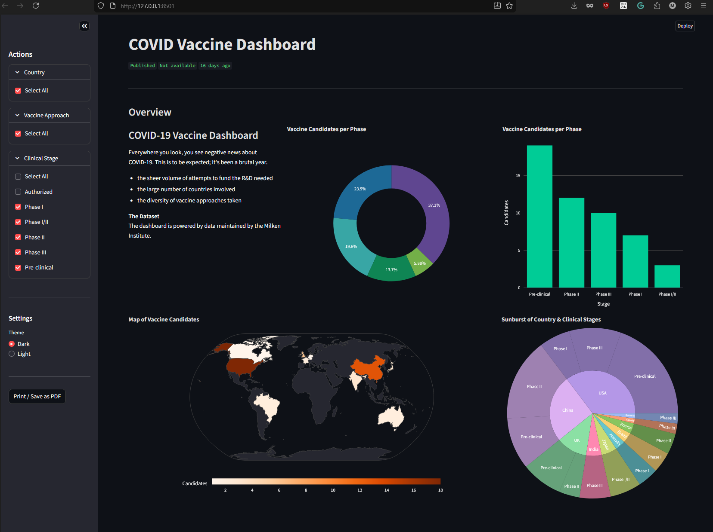
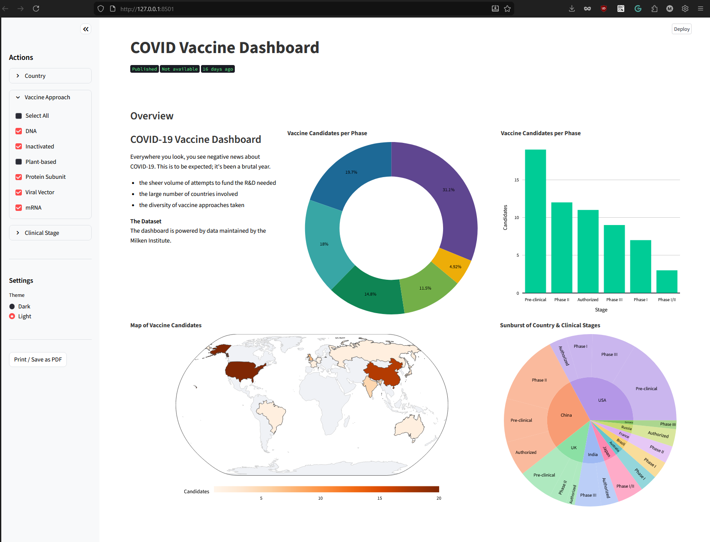
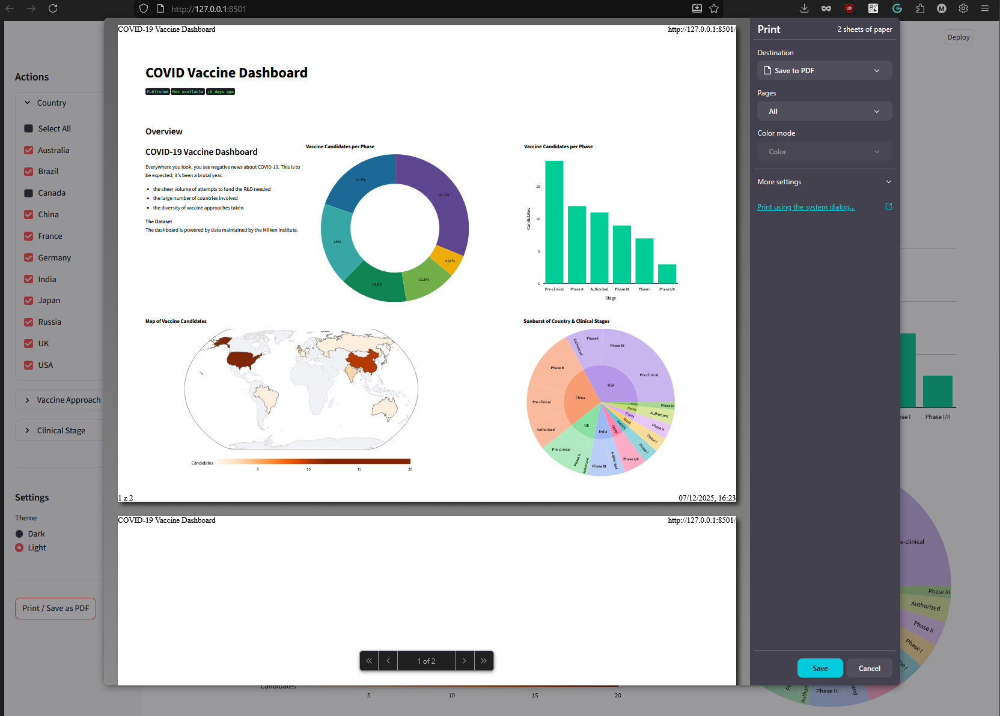

# Streamlit POC
> COVID-19 Vaccine Dashboard, powered by data maintained by the Milken Institute.

### UI Overview

#### Dark-theme


#### Light-theme


#### Print/Save as PDF


### Project structure
```
src/
├── main.py              # main script
├── config.py            # app configs
├── domain/
│   └── models.py        # data models
├── services/
│   ├── base_data.py     # Protocol definition
│   ├── mock_data.py     # Mock data provider
│   └── postgres_data.py # PostgreSQL data provider
└── ui/
    ├── __init__.py      
    ├── components.py    # chart components
    ├── sidebar.py       # sidebar controls
    └── styles/          # CSS styles
        ├── __init__.py
        ├── themes.py
        └── style_manager.py
```

### Start guide
```
pip install -r requirements.txt
```
```
streamlit run src/main.py
```